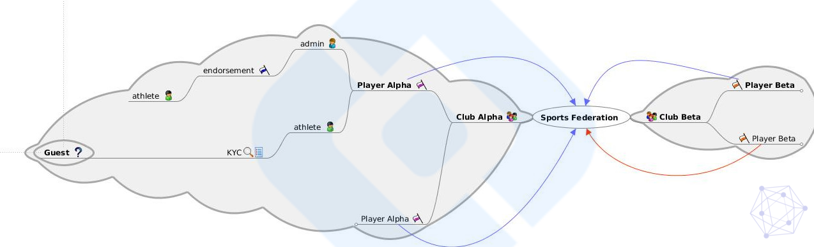

# Sports Federation Network


[Use online visualizer](https://www.rollapp.com/app/freemind) for the file `mindmaps/Sports-Federation-0.9.mm`

## Requirements

* **VirtualBox** - 5.0 or later
* **Vagrant** - 1.9 or later
* *BIOS Enabled Virtualization*

## 1. VM Setup

Boot up the VM & log in 

```bash
vagrant up \
  && vagrant ssh
```
Then navigate to the `workspace` folder and execute following to install the required prerequisits for the demo:

> NOTE: All of the following commands should be executed from within the Virtual Machine (VM).

### 1.1. HLF Runtime & Tools (VM)

```bash
./scripts/prereqs-ubuntu.sh \
  && ./scripts/install-prereq.sh \
  && ./scripts/install-composer.sh \
  && ./scripts/install-fabric-tools.sh

sudo systemctl daemon-reload
```

### 1.2. HLF Composer REST Server

```
npm install -g composer-rest-server
```
### 1.3. Yeoman & Angular Tools

```
npm install -g yo
```
```
npm install -g typings \
  && npm install -g bower \
  && npm install -g @angular/cli \
```

> To verify that this step has completed successfully, see the results of `yo --help` and `ng --help` commands

## 2. BNA Setup (VM)

From within the VM  follow these steps:

### 2.1. Start Fabric runtime & Create PeerAdmin card

**NOTE:** *The example uses the default Fabric network infrastructure (`.example.com`)*

```bash
./fabric-tools/startFabric.sh
./fabric-tools/createPeerAdminCard.sh
```

> To verify that the fabric runtime had started, see results of `docker images` command.

### 2.2. Deploy the BNA to the network

```bash
./dist/deploy.sh
```
The `deploy.sh` script performs some important steps *(starting from 0)*: 

1. *(Specify new version as first CLI argument in case of Upgrade)*
2. Create the archive if it doesn't exist
3. Install Business Network 
4. Start Business Network 
5. Import Network Admin identity
6. Create Guest identity
7. Ping Business Network to verify that it's operational

> To verify that the network is operational, watch for results of the  `composer network ping` command at the end of execution.

## 3. Initialize Middleware (VM)


```
composer-rest-server
```
When asked, enter `admin@sportsnet` as the name of the business card to use, the rest of the options can be defaulted. 
Leave this running since it's required to connect to the Fabric Runtime via HTTP.

> To verify that the middleware has started, see the REST playground at http://localhost:3000/ .

## 4. Create Front End (VM)

### 4.1. Generate Angular scaffold
```
yo hyperledger-composer:angular
```
### 4.2. Run the `ng` webserver
from within the newly generated scaffold directory run
```
npm start .
```
> To verify that the FE is working, see the result of the generated scaffold at http://localhost:4200/